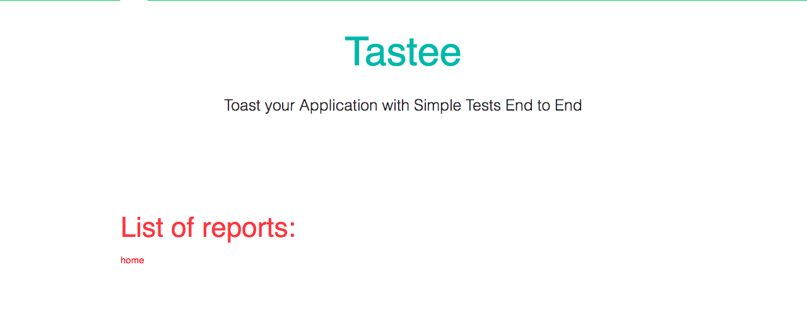
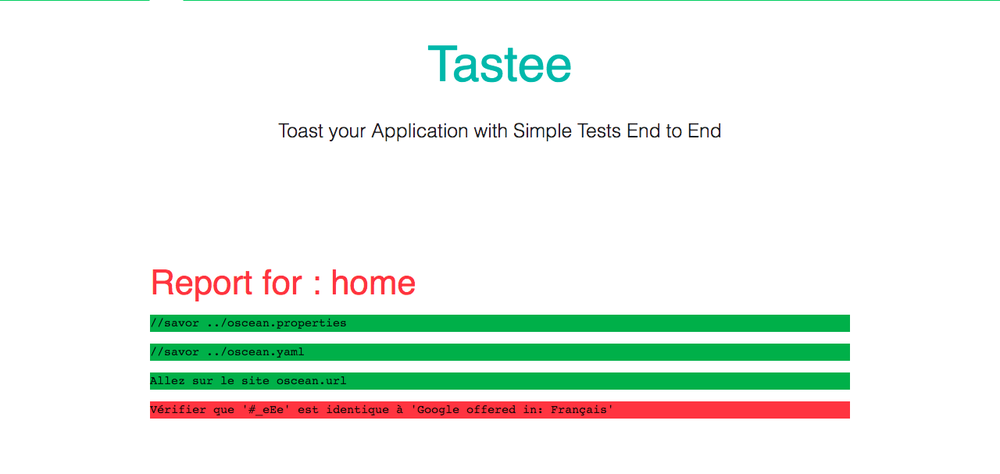

# Continuous Integration

Once you have finished creating your scenarios with the Tastee tool, we advise you to use a continuous integration factory to obtain reports that you can then use or send directly to your customer.

For that we know you to version all your files on a repository git.

Once all your files versioned on GIT, we know you to use Docker and Jenkins.

The configuration in Jenkins is done via a JenkinsFile file that you can create in your Tastee repository. This JenkinsFile will launch all of your Tastee files in a docker available [here](https://hub.docker.com/r/tastee/tastee/).

Here is the JenkinsFile file to create:

```json
pipeline {
    stages {
        stage('Run all Tastee on Firefox') {
            steps {                
                sh 'docker run -v $WORKSPACE:/tmp/tastee tastee/tastee -b firefox -h true -o /tmp/tastee/reporting /tmp/tastee/scenarii'
            }
        }
        stage('Reporting'){
            steps {
                publishHTML (target: [
                    allowMissing: false,
                    alwaysLinkToLastBuild: false,
                    keepAll: true,
                    reportDir: 'reporting',
                    reportFiles: 'index.html',
                    reportName: "Tastee Report"
                    ])
            }
        }
    }
}

```

When you launch this build, reports will automatically be generated.

Here's an example of a report you can get:




