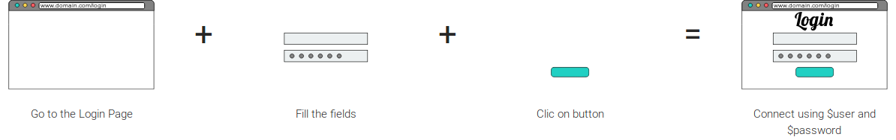

# Create your own instructions (or DSL)

Since the Browser Specific Langage ([BSL](./main-bsl.md)) is not enough to create a readable documentation using Tastee, you will need to create your own instruction. Some may talk of your own Domain Specific Langage (or DSL).

Using Tastee, you don't need any specific skills to create your own instruction, you just need to reuse existing ones to create a new.

## Creating instruction file

First, it is best to create a specific file to host your own instructions.  
Lets create a file : `custom.yaml`

As you can see, instruction files are structured using [YAML](https://fr.wikipedia.org/wiki/YAML)

## Creating a new instruction

### Instruction structure

An instruction is structured using this format :
```
[new instruction name with its parameters]:
    - [first instruction]
    - [second instruction]
    - [third ...]
```
The **[new instruction name with its parameters]** is a simple phrase (or a suite of words...) where **parameters** can be inserted.
**Parameters** are simple labels which first character is a `$` (like `$name`). They can then be used within the list of instruction using the same label.

exemple : 
```
new instruction with a $parameter:
    - Go to $name
```

If, in your Tastee script, you write `new instruction with a 'http://tastee.github.io'`, this instruction will redirect your browser to the Tastee website.

## Using your own instruction

In order to use the instruction file in your script, you'll need to specify which file you want to eat using `//savor custom.yaml`

## The login example

Let's think about most login form are working.  
Usually, you, first, type your login, then your password and finally hit 'ENTER' or click on the submit button.  

What would it be using Tastee ?  


```
The user connects using $login and $password:
    - Go to 'https://my-web-site.io/login'
    - Fill '#loginInputId' field with $login
    - Fill '#passwordInputId' field with $password
    - Click on '#loginButtonId'
```

Now you can use the `The user connects using 'admin' and 'admin'` in any of your script !
(Note : for the sake of security, please, don't use admin/admin as credential in your apps)
