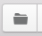
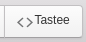

# Getting Started

## installation & Launch

If you have not installed yet Tastee, please follow this installation steps for [Linux](../installation/linux.md), [Mac OS X](../installation/osx.md) or [Windows](../installation/windows.md)

## Select a folder for your specification

Click on the folder button  
  

Then select the wanted folder

## Create the specification files

In the "Files" section, click on your folder then the "+" button to create new files :
* `common-en.yaml`
* `custom-parameter.properties`
* `getting-started.html`

## Setup community driven Browser Specific Language

In the `common-en.yaml` file, copy-paste the BSL from [Github](https://github.com/tastee/tastee-examples/blob/master/common/common_en.yaml)

Note: english BSL is used for the example (you are free to use [others](https://github.com/tastee/tastee-examples/tree/master/common))

This will give you access to the main [browser instructions](./main-bsl.md)

## Setup some parameters

In the `custom-parameter.properties` file, type :

```
Tastee.web.site = https://tastee.github.io
Tastee.menu = .button-collapse > i:nth-child(1)
```

This will replace `Tastee.web.site` by the url (useful when you want to manage different platform for example)

Read more on [Tastee parameters](./tastee-parameters.md)

## Write your Tastee specification

In the  `getting-started.html` file, copy-paste the following : 

> **Tastee Documentation**
>
> 
>
> *//savor common-en.yaml*  
> *//savor custom-parameter.properties*  
>
> To access Tastee documentation,  
> *Go to Tastee.web.site*  
> *Click on Tastee.menu* 
> *Click on '#documentationLink'*  
> *Check that '#tastee' is equal to 'Tastee'*   
> The Documentation should be displayed  

Then select, one by one, the following line to be executed (//savor..., Go to ... Click on ... and Check that ...) and click on the Tastee button to make then executable  



## Execute your Tastee specification

Click on the green execution Button (the Play Button), a Chrome browser should start.

Then execute the lines by clicking on the play buttons that appeared, one by one. Content of the Chrome Browser should change as you click. 

