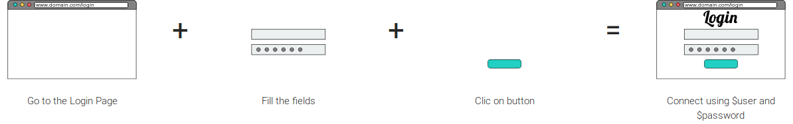

# Why ? 

There are many existing Behaviour-Driven Development tools available that help to write and execute software specifications in order to validate what scenarios and examples say. Some of them, like [Cucumber](https://cucumber.io/), are already widely used and fits many project needs.

## So, Why another BDD tool ?

Unfortunately, some projects are still failing to implement BDD even if they believe it would help them design better softwares.

So, let's think about the reasons of these failures. Mainly 2 causes are brought by many blogs : it is either a humain problem, either a matter of techniques.

In case of humain problems, you won't find any solutions in tools, and Tastee will not give you the right answer, too. Take time to review your organization and read about [BDD](https://en.wikipedia.org/wiki/Behavior-driven_development) implementation

Many failure statements claims that making scenarios executable and automate them is too costly for the project. In fact, Developpers have to implement the code that will make scenarios executable (using [Selenium](https://www.seleniumhq.org/) for example), but they also have to write the code to implement the software needs, and when the time comes to release, to fix critical bugs, to implement new features, scenarios are described, software code is written, but noone have time to write code to make the link between them. (They usualy forget that they are behaviour-driven and the project become code-driven).

A solution usualy stated is to follow basic syntax rules such as [Gherkin](https://martinfowler.com/bliki/GivenWhenThen.html) by using steps and keywords making them reusable and, therefore, are already implemented within the code. This is called a Domain Specific Language (DSL)

Using a specific DSL will then bring complexity to stakeholders that have to follow it to describe the needs which is another cause of faillure : stakeholders are having troubles to describe precise scenarios while following a DSL.

So either project have no time to code tests, either it forgets the "simple behaviour description" rule (one of the basics of BDD) to fit complex DSL.

## What does Tastee do differently ?

Let's take the problem the other way :  
The software to test are [Web Applications](https://en.wikipedia.org/wiki/Web_application) that runs in a "web browser".
Users are limited in the actions they can do with a Web Browser. They can :

* Go to a website using the address bar
* Click on buttons or links
* Fill some fields
* Drag and drop elements
* Read some text
* ...

By compiling some of them, more complex actions can be created such as "Connect to a website using a username and password" and so on ...

This why Tastee is trying to provide its users an extensible "Browser Specific Language" to help him implement any action using its natural language.
